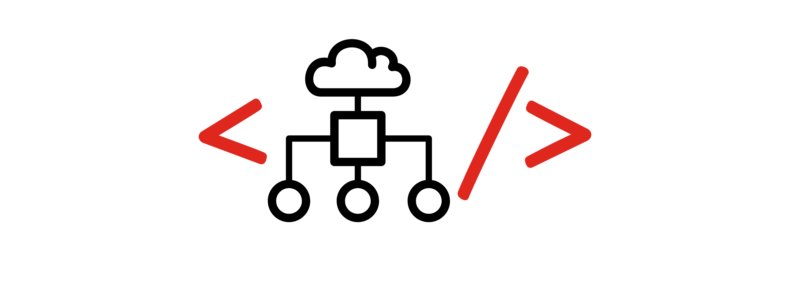

# npearce.github.io

Greetings! This is where I prototype new ideas that I'm pondering at F5 Networks.

## GitHub Webhook Server for F5 BIG-IP

Historically, Infrastructure as Code has been focused on servers and software stacks. More recently it has spread to include networking technology, bringing us Network Infrastructure as Code (NIaC).

To learn more about NIaC, visit: [https://redtalks.live/niac](https://redtalks.live/niac)

To take a look at the iControl LX webhook server, which deliver NIaC for the F5 BIG-IP, take a look at the repository, here: [https://npearce.github.io/n8-GHE_IaC_WebHook](https://npearce.github.io/n8-GHE_IaC_WebHook/)

## BigStats

* [https://npearce.github.io/n8-BigStats/](https://npearce.github.io/n8-BigStats/)