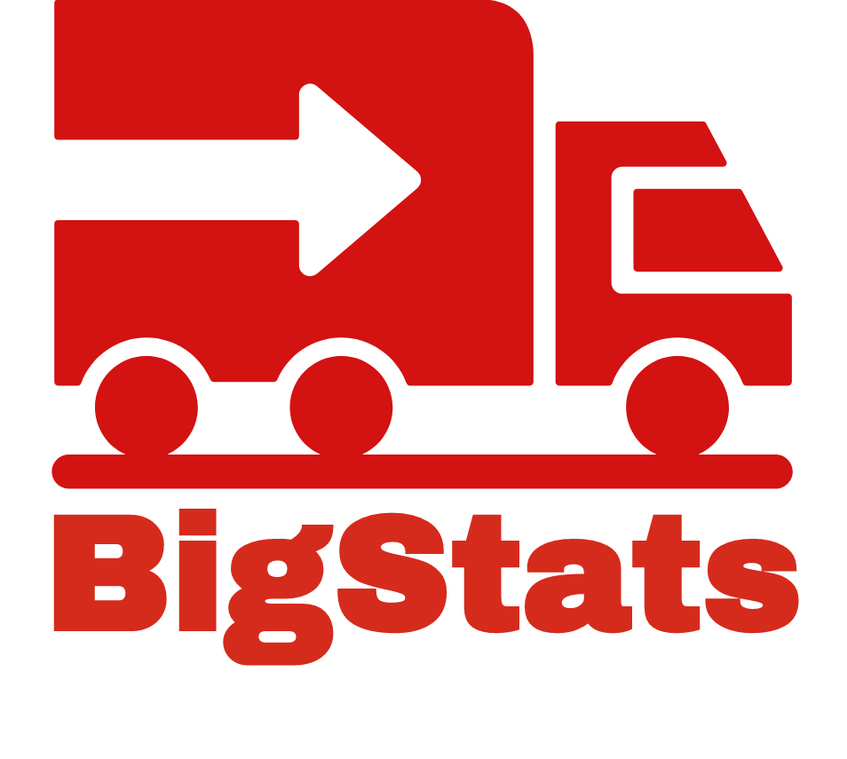

# Prototypes

Greetings! This is where I create and share prototypes of ideas that I'm pondering at F5 Networks. All work posted here is 'community supported', which means if you run into a problem, please create a GitHub Issue under the repository and I will test/fix as soon as I can.

There's no SLA on this because its opensource!

---

## GitHub Webhook Server for F5 BIG-IP

Historically, Infrastructure as Code has been focused on servers and software stacks. More recently it has spread to include networking technology, bringing us Network Infrastructure as Code (NIaC).

To learn more about NIaC, visit: [https://redtalks.live/niac](https://redtalks.live/niac)

To take a look at the iControl LX webhook server, which deliver NIaC for the F5 BIG-IP, take a look at the repository, here: [https://npearce.github.io/n8-GHE_IaC_WebHook](https://npearce.github.io/n8-GHE_IaC_WebHook/)

---

## BigStats

Increasingly popular is the implementation of telemetry piplines, the practice of consolidating statistical feedback into a single system instead of supporting numerous vendor dashboards.

BigStats is a *stat exporter* that runs on the F5 BIG-IP allowing administrators to configure destinations including:

* http/https
* StatsD
* Apacke Kafka

[https://npearce.github.io/n8-BigStats/](https://npearce.github.io/n8-BigStats/)

---